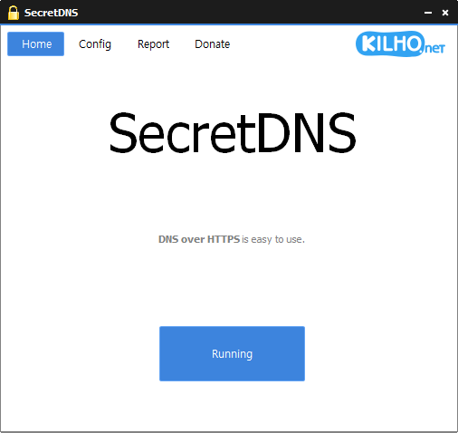

# SecretDNS

**Herramienta gratuita para Windows que evita la vigilancia de Internet (DPI) con DNS sobre HTTPS y fragmentación SNI, activada con un solo clic.**

[English](README.md) · [한국어](README.ko.md) · [简体中文](README.zh-CN.md) · [日本語](README.ja.md) · Español · [Português (Brasil)](README.pt-BR.md) · [Français](README.fr.md)

> Este documento es una traducción. Si hay alguna diferencia, la [versión en coreano](README.ko.md) es la que prevalece.

## Descripción general

Al abrir un sitio web, el equipo envía dos cosas en texto plano: una **consulta DNS** que pide la dirección IP del sitio y el **nombre del sitio (SNI)** que viaja en el primer paquete de cada conexión HTTPS. Los equipos de inspección (DPI) de los operadores o administradores de red leen ambos para saber qué sitio visita y, si quieren, cortan la conexión o lo redirigen a una página de advertencia.

SecretDNS cierra ambos agujeros con un solo clic en **Ejecutar**.

- **DNS** — Procesa las consultas DNS del equipo con **cifrado (DoH)** a través de un servidor como Cloudflare. No toca la configuración de red de Windows, así que al detener el programa todo vuelve a la normalidad al instante; y si el equipo se apaga de repente mientras está en ejecución, al reiniciar Internet funciona como siempre, sin dejar rastro.
- **SNI** — **Evita que el nombre del sitio quede expuesto a los equipos de inspección** en las conexiones HTTPS. La conexión al sitio funciona como siempre y, como solo se procesa la parte del nombre, apenas hay pérdida de velocidad.

Los sitios que dejan de funcionar al fragmentarse (bancos, pasarelas de pago) pasan intactos gracias a una **lista de excepciones** integrada, y en el **Informe** puede ver cómo se procesó cada sitio. Para los sitios que la evasión DNS no puede abrir — como el **error 451**, habitual en países sin libertad en Internet, donde el propio sitio rechaza las conexiones desde ese país — el **Proxy mixto** hace que solo esos sitios pasen por otro país. Solo los dominios que indique pasan por ahí, así que el resto de su Internet conserva toda su velocidad.

SecretDNS no es una VPN. No oculta su dirección IP ni cifra todo el tráfico: solo procesa los dos puntos que se usan para la vigilancia, DNS y SNI.

## Funciones principales

- **Un solo clic** — Basta con pulsar **Ejecutar** en la pantalla de inicio. Un clic en el icono de la bandeja también lo activa y desactiva.
- **DNS sobre HTTPS** — Cloudflare por defecto. Añada sus propios servidores y marque varios; SecretDNS cambia entre ellos automáticamente. También hay un modo **Servidores** que usa un servidor DNS sin cifrar (p. ej. 1.1.1.1).
- **Sin cambios en la configuración de Windows** — No se modifica la configuración DNS del adaptador de red. Al detener no queda rastro, y tras un corte de luz o un apagado forzado, al reiniciar todo vuelve a la normalidad.
- **Fragmentación SNI** — Evita que el nombre del sitio quede expuesto en conexiones HTTPS y HTTP.
- **Lista de excepciones / Lista manual** — Elija qué sitios no fragmentar, o solo cuáles fragmentar. Unos 160 dominios (bancos, pagos, portales, juegos …) vienen integrados como excepciones.
- **Solo navegadores** — Aplica la fragmentación solo a los navegadores principales, sin tocar juegos ni programas de trabajo.
- **Paquete falso** — Un método de evasión adicional para las redes donde la fragmentación por sí sola no basta.
- **Conexión que no se corta** — Antes de iniciar comprueba que el servidor DNS es accesible; si el servidor deja de responder durante la ejecución, Internet no se corta y el cifrado se reanuda automáticamente cuando el servidor vuelve. Internet sigue funcionando tras la suspensión o un cambio de Wi-Fi.
- **Informe** — Tabla de dominios y resultado aplicado (cifrado, fragmentado, texto plano, vía servidor …), por separado para DNS y SNI, con copia al portapapeles.
- **Proxy mixto** — Solo los dominios de la lista pasan por un servidor en el extranjero. Sirve para abrir sitios bloqueados con error 451 que el DNS no puede evadir; el resto conecta directamente como siempre, sin pérdida de velocidad.
- **Inicio automático · bandeja** — Inicio con Windows y minimización al área de notificación al cerrar.
- **8 idiomas** — Coreano · inglés · japonés · chino · ruso · italiano · francés · español. Sigue el idioma de Windows.

## Descarga / Instalación

| Tipo | Enlace |
|---|---|
| Instalador | [Descargar](https://down.kilho.net/secretdns?lang=es) |
| Portable (ZIP) | [Descargar](https://down.kilho.net/secretdns?lang=es&nosetup) |

El instalador ejecuta SecretDNS al terminar y lo registra para **iniciarse con Windows**. Para la versión portable, descomprima el ZIP y ejecute `SecretDNS.exe`. En ambos casos SecretDNS pide **permisos de administrador**.

Diferencia entre las dos versiones: la función **Proxy mixto** solo está incluida en la versión con instalador (en la portable la opción aparece bloqueada).

## Uso

### Flujo básico

1. Inicie SecretDNS. Cuando aparezca la ventana de permisos de administrador, pulse **Sí**.
2. Pulse **Ejecutar** en la pantalla de inicio. El botón muestra brevemente **Comprobando la red**, luego pasa a **Ejecutando** y el icono del área de notificación (bandeja) cambia al estado activado.
3. Use el navegador como siempre. No hay nada más que hacer.
4. Para desactivarlo, pulse de nuevo el botón **Ejecutando** o haga un clic en el icono de la bandeja. Al cerrar la ventana el programa se cierra (con **Minimizar a la bandeja al salir** activado, va a la bandeja).

Qué se activa se decide en la pestaña **Configuración**. Durante la ejecución la configuración queda bloqueada, así que deténgalo antes de cambiarla (la lista del proxy mixto es la excepción: se aplica al instante incluso en ejecución).

### Distribución de la pantalla

Arriba están las pestañas **Inicio · Configuración · Informe · Donar**; al pulsar el logotipo de la derecha se abre la página web.

**Configuración**

| Elemento | Qué hace |
|---|---|
| **Configuración DNS** — Desactivado / Servidores / DNS sobre HTTPS | Cómo se procesan las consultas DNS. **[…]** abre la ventana **Servidores DNS** para editar la lista de servidores |
| **Configuración SNI** — Desactivado / Fragmento / Fragmentoⓜ | Fragmentar todos los sitios (salvo la lista de excepciones) o solo los de la lista manual |
| Lista **Excepción** / **Manual** | Lista de dominios que cambia según la configuración SNI. Un dominio por línea |
| **Minimizar a la bandeja al inicio** | Inicia en la bandeja al iniciar sesión (inicio con Windows). Si la última vez estaba en ejecución, también activa la protección automáticamente |
| **Minimizar a la bandeja al salir** | Al cerrar la ventana no se cierra, va a la bandeja |
| **Habilitar proxy mixto** + **[…]** | Solo los dominios de la lista pasan por un servidor en el extranjero. **[…]** edita la lista (versión con instalador, requiere una configuración DNS activa) |
| **Habilitar informe** | Guarda registros en la pestaña Informe |
| **Solo navegadores** | Aplica fragmentación y paquete falso solo al tráfico de los navegadores |
| **Habilitar paquete falso** | Método de evasión adicional para redes donde la fragmentación no basta |

**Informe** — Tres columnas: **Tipo** (DNS · SNI · VPN), **Dominio** y **Aplicado**. Cada línea idéntica se guarda una sola vez, y las líneas con la columna Aplicado vacía (enviadas sin procesar) se muestran atenuadas. **Copiar** / **Copiar(Todo)** copian texto separado por tabulaciones; **Borrar** vacía la lista.

**Icono de la bandeja** — Un clic alterna Ejecutar/Detener. El menú contextual tiene **SecretDNS** (mostrar ventana) · **Ejecutar** · **Detener** · **Kilho.net** · **Salir**. Al pasar el ratón se muestra la versión y el estado actual.

### Qué hacer cuando…

**Un sitio redirige a una página de advertencia o la conexión se corta**
Con la configuración por defecto (DNS **DNS sobre HTTPS** o **Servidores** + SNI **Fragmento**), basta con pulsar **Ejecutar** para resolver la mayoría de los casos. Active el informe y entre en el sitio: la línea `SNI` debe decir **Fragmento** y la línea `DNS`, **DNS sobre HTTPS**. Si sigue sin funcionar, pruebe **Habilitar paquete falso** más abajo.

**Un sitio dejó de abrirse tras activar SecretDNS (banco, pago, inicio de sesión de un juego …)**
El tráfico de ese sitio no tolera la fragmentación. Añada su dominio en una línea de la lista **Excepción** en Configuración y vuelva a ejecutar.
- Escríbalo **empezando por un punto**, como `.example.com`, para que coincida con `example.com` y todos sus subdominios (`www.example.com`, `m.example.com`).
- Puede pegar la URL de la barra de direcciones tal cual: `https://`, `www.` y la ruta final se eliminan automáticamente.
- La lista se guarda al hacer clic en otro sitio y se aplica **a partir de la siguiente ejecución**.
- Unos 160 dominios — bancos, tarjetas, pagos, portales, compras, juegos, gobierno (`.go.kr`), escuelas (`.ac.kr`) — ya vienen integrados como excepciones, así que no hace falta escribirlos. Siguen funcionando aunque vacíe la lista.

**Fragmentar solo unos pocos sitios y no tocar el resto**
Cambie la configuración SNI a **Fragmentoⓜ** y la lista de abajo pasa a ser la lista **Manual**. Solo se fragmentan los dominios escritos aquí; todo lo demás se envía intacto. Si solo le dan problemas uno o dos sitios, esta opción es más segura. Las reglas de escritura son las mismas que en la lista de excepciones.

**Cifrar solo el DNS, sin fragmentación**
Ponga la configuración DNS en **DNS sobre HTTPS** y la SNI en **Desactivado**. Al contrario, para dejar el DNS como está y usar solo la fragmentación, ponga DNS en **Desactivado**. Con ambos desactivados aparece "No hay funciones para ejecutar.".

**Aparece "No se puede conectar al servidor DNS cifrado (DoH)."**
Algunas redes de empresas o centros educativos tienen Internet pero no llegan a ciertos servidores DoH. Hay dos opciones:
- Pulse **[…]** junto a la configuración DNS y, en la lista **DNS sobre HTTPS**, marque otro servidor (por ejemplo **cloudflare-dns.com** de la lista por defecto).
- O cambie la configuración DNS a **Servidores**. Sin cifrado, pero conserva el efecto de usar otro servidor DNS sin cambiar la configuración de Windows.

**Usar otro servidor DNS**
Pulse **[…]** junto a la configuración DNS para abrir la ventana **Servidores DNS**. A la izquierda está la lista **Servidores** (direcciones IP) y a la derecha la lista **DNS sobre HTTPS**.
- Con **Agregar** introduzca **Nombre · Dirección 1 · Dirección 2** (de reserva, puede dejarse vacía). Los servidores llevan una dirección IPv4 como `8.8.8.8`; DoH lleva una dirección como `https://1.1.1.1/dns-query` o `https://dns.google/dns-query`.
- Solo se usan los servidores **marcados**. Si marca varios, cuando uno no responde se pasa automáticamente a otro. Si no marca ninguno, se usa Cloudflare.
- La lista por defecto incluye Cloudflare (marcado) y Google (sin marcar).
- Los cambios se aplican **a partir de la siguiente ejecución**.

**No afectar a juegos ni programas de trabajo**
Active **Solo navegadores**. La fragmentación y el paquete falso se aplican solo al tráfico de los navegadores principales como Chrome · Edge · Firefox · Whale; los demás programas no se tocan. El cifrado DNS sigue aplicándose sea cual sea el programa.

**Sigue bloqueado incluso con fragmentación**
Pruebe **Habilitar paquete falso**. Es un método de evasión adicional para los equipos de inspección que la fragmentación por sí sola no consigue superar, y no afecta a la conexión real.

**Abrir sitios bloqueados pasando solo esos por un servidor en el extranjero (Proxy mixto)**
En los países donde no está garantizada la libertad en Internet, un sitio puede rechazar por completo las conexiones procedentes de ese país y el navegador muestra un **error 451** (Unavailable For Legal Reasons). Es algo raro en los países con Internet libre. En ese caso ni el cifrado DNS ni la fragmentación lo abren, porque el bloqueo se basa en el país desde el que se conecta. El proxy mixto hace que solo esos sitios pasen por un servidor de otro país.
En la versión con instalador, con una configuración DNS activa, marque **Habilitar proxy mixto** y pulse **[…]** para abrir la ventana de la lista. Escriba un dominio por línea (`.example.com`, misma regla que la lista de excepciones) y pulse **Aceptar**.
- Solo los dominios de la lista pasan por el servidor en el extranjero; el resto conecta directamente como siempre. A diferencia de una VPN completa, los demás sitios conservan su velocidad.
- El servidor se asigna automáticamente en cada ejecución y, si no responde, se pasa automáticamente al siguiente.
- La lista se aplica **incluso en ejecución**.
- En el informe queda como tipo **VPN**, aplicado **Vía servidor**.
- El proxy mixto requiere una configuración DNS activa y se desactiva junto con ella al poner DNS en Desactivado.

**Tenerlo activado cada vez que se enciende el equipo**
Marque **Minimizar a la bandeja al inicio** (el instalador ya lo registra). Al iniciar sesión arranca en la bandeja sin ventana y, **si la última vez lo dejó en ejecución**, también activa la protección automáticamente. Si lo detuvo y salió usted mismo, en el siguiente arranque no se activa y queda a la espera.
Si el Wi-Fi tarda en conectarse tras el arranque, se inicia automáticamente en cuanto hay red.

**Mantenerlo activo después de cerrar la ventana**
Active **Minimizar a la bandeja al salir**; al pulsar cerrar (×) no se cierra, sino que va a la bandeja. Para salir del todo, clic derecho en el icono de la bandeja → **Salir** (aparece una confirmación). Al salir, la protección también se desactiva.

**Ver cómo se está procesando cada sitio ahora mismo**
Active **Habilitar informe** y abra la pestaña **Informe**. Los dominios visitados durante la ejecución se van añadiendo línea a línea.

| Tipo | Aplicado | Significado |
|---|---|---|
| DNS | **DNS sobre HTTPS** | Consultado a través del servidor cifrado |
| DNS | **Texto plano** | Consultado a través del servidor indicado (sin cifrado) |
| SNI | **Fragmento** | El nombre del sitio se envió fragmentado |
| SNI | (vacío) | Enviado sin procesar: el sitio está en la lista de excepciones |
| VPN | **Vía servidor** | Pasó por el servidor en el extranjero mediante el proxy mixto |

Con **Copiar(Todo)** puede pegarlo en el Bloc de notas o Excel con las columnas separadas.

**Por qué Internet no se corta aunque el servidor DNS no responda**
SecretDNS comprueba antes de ejecutarse que el servidor DNS es accesible y, si durante la ejecución el servidor deja de responder un tiempo, lo gestiona automáticamente para que Internet no se detenga. Cuando el servidor vuelve, regresa automáticamente al funcionamiento normal; mientras tanto, el estado se ve en el icono de la bandeja y en el informe. No hace falta volver a ejecutarlo tras salir de la suspensión o cambiar de Wi-Fi.

**Aparece un aviso sobre el controlador**
En raras ocasiones puede aparecer un aviso pidiendo reiniciar el equipo antes de ejecutar. Basta con reiniciar como se indica.

**El equipo se apagó durante la ejecución**
No hay de qué preocuparse. SecretDNS no cambia la configuración de red de Windows y solo actúa mientras está en ejecución, así que tras un corte de luz o un apagado forzado, al encender de nuevo Internet funciona como siempre. Con el inicio automático activado, vuelve a iniciarse solo tras iniciar sesión.

## Configuración

Se cambia en la pestaña **Configuración** y se guarda al instante. La mayoría se aplica **a partir de la siguiente ejecución**, y la configuración se conserva al actualizar.

| Elemento | Por defecto (instalador) | Por defecto (portable) |
|---|---|---|
| Configuración SNI | Fragmento | Fragmento |
| Lista de servidores DNS | Servidores: Cloudflare ✓, Google / DoH: Cloudflare ✓, cloudflare-dns.com ✓, Google | igual |
| Minimizar a la bandeja al inicio | Activado | Desactivado |
| Minimizar a la bandeja al salir | Activado | Desactivado |
| Habilitar proxy mixto | Desactivado | No disponible |
| Habilitar informe | Desactivado | Desactivado |
| Solo navegadores | Desactivado | Desactivado |
| Habilitar paquete falso | Desactivado | Desactivado |

El idioma de la interfaz sigue el idioma de Windows (coreano · inglés · japonés · chino · ruso · italiano · francés · español; en otro caso, inglés).

## Requisitos

- Windows 10 o Windows 11 (32 y 64 bits)
- **Permisos de administrador** — en cada inicio aparece una ventana de confirmación de permisos.
- No se necesita ningún runtime adicional.
- Conexión a Internet — para la comprobación del servidor DNS y los avisos de nueva versión.

## Actualizaciones

SecretDNS **no** se actualiza solo. Al iniciarse comprueba si hay una versión nueva y muestra un aviso; al pulsar **Sí** se abre la página de descarga y el programa se cierra. Las nuevas versiones se publican manualmente tras una verificación interna y se anuncian en la [página de SecretDNS](https://v2.kilho.net/secretdns). Consulte el [aviso sobre la política de actualizaciones](https://en.kilho.net/archives/notice/2940).

**Historial de versiones**

| Versión | Fecha | Cambios |
|---|---|---|
| 4.0.5 | 2026-09-15 | Cambio automático de servidor del proxy mixto para conexiones más estables; el uso de VPN se identifica más fácilmente en el informe |
| 4.0.4 | 2026-09-14 | Actualización e inicio automático más fiables; proxy mixto rediseñado (ventana de edición de dominios, configuración guardada); ventana de servidores DNS para añadir y elegir servidores; mejor conectividad de DNS cifrado en algunos operadores (direcciones por nombre, nuevo punto de conexión de Cloudflare); orientación para elegir otro servidor en caso de fallo; textos del informe más claros |
| 4.0.2 | 2026-09-04 | Solucionadas interrupciones intermitentes de Internet en algunos entornos; cambio automático de servidores DNS inestables; los sitios siguen abriéndose durante errores DNS temporales; el cifrado se restablece automáticamente cuando la red se estabiliza |
| 4.0.1 | 2026-08-25 | Corregida la falta de Internet justo tras el arranque en algunos PC; mejor conectividad tras suspensión, VPN o cambio de Wi-Fi; recuperación automática ante caídas de Internet; se muestra el estado de espera y recuperación |

## Licencia

SecretDNS es **freeware**. Puede usarlo gratis y sin restricciones en cualquier lugar — empresa, casa, organismos públicos, escuela — y redistribuirlo libremente.

## Enlaces

- Sitio web: <https://v2.kilho.net/secretdns>
- Foro: <https://groups.google.com/g/kilhonet>
- X (Twitter): <https://www.twitter.com/kilhonet>

© KILHO.NET
