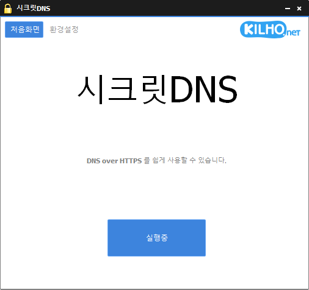

# 시크릿DNS (SecretDNS)

**DNS over HTTPS 와 SNI 파편화로 인터넷 감청(DPI)을 우회하는, 클릭 한 번으로 켜는 Windows 용 무료 프로그램.**

[English](README.md) · 한국어 · [简体中文](README.zh-CN.md) · [日本語](README.ja.md) · [Español](README.es.md) · [Português (Brasil)](README.pt-BR.md) · [Français](README.fr.md)

## 개요

웹사이트에 접속할 때 컴퓨터는 두 가지를 평문으로 내보냅니다. 먼저 사이트 주소를 IP 로 바꿔 달라는 **DNS 질의**, 그리고 HTTPS 로 연결할 때 첫 패킷에 실리는 **사이트 이름(SNI)** 입니다. 통신사나 네트워크 관리자의 감청 장비(DPI)는 이 둘을 읽어 어떤 사이트에 가는지 알아내고, 필요하면 접속을 끊거나 경고 페이지로 돌립니다.

시크릿DNS는 **[실행하기]** 한 번으로 이 두 구멍을 막습니다.

- **DNS** — 컴퓨터의 DNS 질의를 Cloudflare 같은 서버에 **암호화(DoH)** 로 처리합니다. Windows 네트워크 설정은 건드리지 않으므로 프로그램을 끄면 그 즉시 원래대로 돌아가고, 실행 중에 컴퓨터가 갑자기 꺼지더라도 다시 켜면 아무 흔적 없이 평소대로 인터넷이 됩니다.
- **SNI** — HTTPS 접속 시 **사이트 이름이 감청 장비에 노출되지 않도록** 처리합니다. 사이트 접속 자체는 평소와 같고, 이름 부분만 처리하므로 속도 저하가 거의 없습니다.

은행·결제처럼 조각내면 깨질 수 있는 사이트는 내장 **예외 목록**으로 그대로 통과시키고, **접속기록**에서 어떤 사이트가 어떻게 처리됐는지 볼 수 있습니다. 인터넷 자유가 보장되지 않는 나라에서 흔한 **451 오류**(그 나라에서의 접속 자체를 사이트 쪽이 막는 것)처럼 DNS 우회로는 열리지 않는 사이트는, **프록시 혼합**으로 그 사이트만 다른 나라를 거쳐 접속할 수 있습니다. 지정한 도메인 외에는 경유하지 않으므로 나머지 인터넷 속도는 그대로입니다.

시크릿DNS는 VPN 이 아닙니다. IP 주소를 숨기거나 트래픽 전체를 암호화하지 않고, 감청에 쓰이는 DNS 와 SNI 두 곳만 처리합니다.

## 주요 기능

- **클릭 한 번** — 처음화면의 **[실행하기]** 만 누르면 됩니다. 트레이 아이콘 클릭으로도 켜고 끕니다.
- **DNS over HTTPS** — Cloudflare 기본. 서버를 직접 추가하고 여러 개를 골라 두면 자동으로 바꿔 씁니다. 암호화 없이 **지정서버**(예: 1.1.1.1)만 쓰는 모드도 있습니다.
- **Windows 설정 무변경** — 네트워크 어댑터의 DNS 설정을 바꾸지 않습니다. 끄면 흔적이 남지 않고, 실행 중 정전이나 강제 종료가 있어도 재부팅하면 평소대로 돌아갑니다.
- **SNI 파편화** — HTTPS · HTTP 접속에서 사이트 이름이 노출되지 않게 합니다.
- **예외 목록 / 지정 목록** — 파편화하지 않을 사이트, 또는 파편화할 사이트만 정합니다. 은행·결제·포털·게임 등 160여 개 도메인이 기본 예외로 들어 있습니다.
- **브라우저 전용** — 주요 브라우저의 통신에만 파편화를 적용하고 게임·업무 프로그램은 건드리지 않습니다.
- **위장패킷 추가** — 파편화만으로 안 되는 회선을 위한 추가 우회 방식입니다.
- **끊기지 않는 연결** — 시작 전에 DNS 서버가 닿는지 먼저 확인하고, 실행 중 서버가 응답하지 않아도 인터넷이 끊기지 않고 서버가 돌아오면 자동으로 이어 갑니다. 절전 복귀·Wi-Fi 변경 뒤에도 인터넷이 멎지 않습니다.
- **접속기록** — DNS · SNI 별로 도메인과 적용 결과(암호화, 파편화, 평문, 서버 경유 …)를 표로 보여 주고 복사할 수 있습니다.
- **프록시 혼합** — 목록에 적은 도메인만 해외 서버를 거쳐 접속합니다. DNS 로는 우회되지 않는 451 차단 사이트를 열 때 쓰며, 나머지는 평소처럼 직접 연결하므로 속도 손해가 없습니다.
- **자동 실행 · 트레이** — Windows 시작 시 자동 실행, 닫을 때 알림 영역으로 최소화.
- **8개 언어** — 한국어 · 영어 · 일본어 · 중국어 · 러시아어 · 이탈리아어 · 프랑스어 · 스페인어. Windows 표시 언어를 따릅니다.

## 다운로드 / 설치

| 구분 | 링크 |
|---|---|
| 설치 파일 | [다운로드](https://down.kilho.net/secretdns?lang=ko) |
| 무설치 (ZIP) | [다운로드](https://down.kilho.net/secretdns?lang=ko&nosetup) |

설치판은 설치가 끝나면 바로 실행되며 **Windows 시작 시 자동 실행**이 함께 등록됩니다. 무설치판은 ZIP 을 풀고 `SecretDNS.exe` 를 실행하면 됩니다. 어느 쪽이든 **관리자 권한**을 요청합니다.

두 판의 차이: **프록시 혼합** 기능은 설치판에만 들어 있습니다(무설치판에서는 항목이 잠겨 있습니다).

## 사용법

### 기본 흐름

1. 시크릿DNS를 실행합니다. 관리자 권한 확인 창이 뜨면 **[예]** 를 누릅니다.
2. 처음화면의 **[실행하기]** 를 누릅니다. 버튼이 잠시 **네트워크 확인 중**으로 바뀌었다가 **실행중**이 되고, 알림 영역(트레이) 아이콘도 켜진 모양으로 바뀝니다.
3. 평소처럼 브라우저를 씁니다. 따로 할 일은 없습니다.
4. 끌 때는 **[실행중]** 버튼을 다시 누르거나 트레이 아이콘을 한 번 클릭합니다. 창을 닫으면 프로그램이 종료됩니다(**닫을 때 알림 영역으로 최소화**를 켜 두면 트레이로 내려갑니다).

무엇을 켜고 끌지는 **환경설정** 탭에서 정합니다. 실행 중에는 설정이 잠기므로 바꾸려면 먼저 중지하세요(프록시 혼합 목록은 예외 — 실행 중에도 바로 반영됩니다).

### 화면 구성

상단에 **처음화면 · 환경설정 · 접속기록 · 후원하기** 탭이 있고, 오른쪽 로고를 누르면 홈페이지가 열립니다.

**환경설정**

| 항목 | 하는 일 |
|---|---|
| **DNS 설정** — 사용안함 / 지정서버 / 암호화(DoH) | DNS 질의를 어떻게 처리할지. **[…]** 를 누르면 서버 목록을 편집하는 **DNS 서버 설정** 창이 열립니다 |
| **SNI 설정** — 사용안함 / 파편화 / 파편화(직접지정) | 파편화를 모든 사이트에 적용(예외 목록 제외)할지, 지정 목록의 사이트에만 적용할지 |
| **예외 목록** / **지정 목록** | SNI 설정에 따라 바뀌는 도메인 목록. 한 줄에 하나씩 적습니다 |
| **윈도우 시작할 때 자동 실행** | 로그온하면 트레이에서 자동으로 시작. 마지막에 실행중이었으면 보호도 자동으로 켭니다 |
| **닫을 때 알림 영역으로 최소화** | 창을 닫아도 종료하지 않고 트레이로 내려갑니다 |
| **프록시 혼합 사용** + **[…]** | 목록의 도메인만 해외 서버 경유. **[…]** 로 목록 편집 (설치판, DNS 설정이 켜져 있어야 함) |
| **접속기록 사용** | 접속기록 탭에 기록을 남깁니다 |
| **브라우저 전용** | 브라우저 통신에만 파편화·위장패킷 적용 |
| **위장패킷 추가** | 파편화만으로 안 되는 회선을 위한 추가 우회 방식 |

**접속기록** — **구분**(DNS · SNI · VPN) · **도메인** · **적용** 세 열입니다. 같은 줄은 한 번만 남고, 적용란이 빈 줄(아무것도 적용하지 않고 내보낸 것)은 흐리게 표시됩니다. **[선택복사]** · **[전체복사]** 는 탭으로 구분된 텍스트로 복사하고, **[비우기]** 는 목록을 지웁니다.

**트레이 아이콘** — 한 번 클릭하면 실행/중지가 바뀝니다. 우클릭 메뉴에는 **시크릿DNS**(창 열기) · **실행하기** · **중지하기** · **만든이 오길호** · **종료하기**가 있습니다. 아이콘에 마우스를 올리면 버전과 현재 상태가 보입니다.

### 이럴 때 이렇게

**특정 사이트가 경고 페이지로 넘어가거나 연결이 끊길 때**
기본 설정(DNS **암호화(DoH)** 또는 **지정서버** + SNI **파편화**)으로 **[실행하기]** 만 누르면 대부분 해결됩니다. 접속기록을 켜고 그 사이트에 들어가 보면 `SNI` 줄에 **파편화**, `DNS` 줄에 **암호화(DoH)** 가 붙어 있어야 정상입니다. 그래도 안 되면 아래의 **위장패킷 추가**를 켜 보세요.

**시크릿DNS를 켠 뒤 어떤 사이트가 안 열릴 때 (은행 · 결제 · 게임 로그인 등)**
그 사이트의 통신이 조각내기에 약한 경우입니다. 환경설정의 **예외 목록**에 도메인을 한 줄 추가하고 다시 실행하세요.
- `.example.com` 처럼 **점으로 시작**해 적으면 `example.com` 과 모든 하위 도메인(`www.example.com`, `m.example.com`)이 걸립니다.
- 주소창의 URL 을 그대로 붙여 넣어도 됩니다 — `https://`, `www.`, 뒤의 경로는 자동으로 떼어 냅니다.
- 목록에서 다른 곳을 클릭하면 저장되고, **다음 실행부터** 적용됩니다.
- 은행·카드·결제·포털·쇼핑·게임·정부(`.go.kr`)·학교(`.ac.kr`) 등 160여 개 도메인은 이미 예외로 내장되어 있어 적지 않아도 됩니다. 목록을 비워도 내장 예외는 그대로 동작합니다.

**몇몇 사이트에만 파편화하고 나머지는 건드리고 싶지 않을 때**
SNI 설정을 **파편화(직접지정)** 으로 바꾸면 아래 목록이 **지정 목록**으로 바뀝니다. 여기 적은 도메인만 조각내고 나머지는 모두 그대로 보냅니다. 문제가 되는 사이트가 한두 개뿐이라면 이쪽이 안전합니다. 적는 규칙은 예외 목록과 같습니다.

**DNS 만 암호화하고 파편화는 쓰지 않을 때**
DNS 설정을 **암호화(DoH)**, SNI 설정을 **사용안함**으로 두면 됩니다. 반대로 DNS 는 그대로 두고 파편화만 쓰려면 DNS 를 **사용안함**으로 하세요. 둘 다 사용안함이면 "실행할 기능이 없습니다" 가 뜹니다.

**"암호화(DoH) 서버에 연결할 수 없습니다" 가 뜰 때**
회사·학교 회선 중에는 인터넷은 되는데 일부 DoH 서버에는 연결되지 않는 곳이 있습니다. 두 가지 방법이 있습니다.
- DNS 설정의 **[…]** 를 눌러 **암호화(DoH)** 목록에서 다른 서버(예: 기본 목록의 **cloudflare-dns.com**)를 체크합니다.
- 또는 DNS 설정을 **지정서버**로 바꿉니다. 암호화는 안 되지만 Windows 설정을 바꾸지 않고 다른 DNS 서버를 쓰는 효과는 그대로입니다.

**다른 DNS 서버를 쓰고 싶을 때**
DNS 설정 옆 **[…]** 를 누르면 **DNS 서버 설정** 창이 열립니다. 왼쪽이 **지정서버**(IP 주소), 오른쪽이 **암호화(DoH)** 목록입니다.
- **[추가]** 로 **이름 · 주소1 · 주소2**(예비, 비워도 됨)를 입력합니다. 지정서버는 `8.8.8.8` 같은 IPv4 주소, DoH 는 `https://1.1.1.1/dns-query` 또는 `https://dns.google/dns-query` 같은 주소입니다.
- 항목 앞의 **체크**를 켠 서버만 사용합니다. 여러 개를 체크하면 하나가 응답하지 않을 때 다른 서버로 자동으로 넘어갑니다. 하나도 체크하지 않으면 Cloudflare 를 씁니다.
- 기본 목록에 Cloudflare(체크됨) 와 Google(체크 해제)이 들어 있습니다.
- 바뀐 목록은 **다음 실행부터** 적용됩니다.

**게임이나 업무 프로그램에 영향을 주기 싫을 때**
**브라우저 전용**을 켜세요. 파편화와 위장패킷을 Chrome · Edge · Firefox · Whale 등 주요 브라우저의 통신에만 적용하고, 그 밖의 프로그램은 손대지 않습니다. DNS 암호화는 프로그램에 상관없이 계속 적용됩니다.

**파편화해도 여전히 막히는 회선일 때**
**위장패킷 추가**를 켜 보세요. 파편화만으로 뚫리지 않는 감청 장비를 위한 추가 우회 방식으로, 실제 접속에는 영향을 주지 않습니다.

**차단된 사이트만 해외 서버를 거쳐 접속하고 싶을 때 (프록시 혼합)**
인터넷 자유가 보장되지 않는 나라에서는 사이트 쪽이 그 나라에서 오는 접속 자체를 거부해 브라우저에 **451 오류**(Unavailable For Legal Reasons)가 뜨는 일이 있습니다. 정상적인 나라에서는 보기 어려운 경우입니다. 이때는 DNS 암호화나 파편화로 열리지 않습니다 — 접속하는 나라를 보고 막는 것이기 때문입니다. 프록시 혼합은 그런 사이트만 다른 나라의 서버를 거쳐 접속하게 합니다.
설치판에서 DNS 설정을 켠 상태로 **프록시 혼합 사용**을 체크하고, 옆의 **[…]** 로 목록 창을 엽니다. 한 줄에 도메인 하나(`.example.com`, 예외 목록과 같은 규칙)를 적고 **[확인]** 을 누르면 됩니다.
- 목록의 도메인만 해외 서버를 거치고, 나머지는 평소처럼 직접 연결합니다. VPN 전체 연결과 달리 다른 사이트의 속도는 그대로입니다.
- 서버는 실행할 때마다 자동으로 배정되며, 응답이 없으면 다음 서버로 자동으로 바꿉니다.
- 목록은 **실행 중에도** 바로 반영됩니다.
- 접속기록에는 구분 **VPN**, 적용 **서버 경유**로 남습니다.
- 프록시 혼합은 DNS 설정이 켜져 있어야 하며, DNS 를 사용안함으로 바꾸면 함께 꺼집니다.

**컴퓨터를 켤 때마다 자동으로 켜 두고 싶을 때**
**윈도우 시작할 때 자동 실행**을 체크합니다(설치판은 설치 때 이미 등록됩니다). 로그온하면 창 없이 트레이에서 시작하고, **마지막에 실행중 상태로 두었다면** 보호도 자동으로 켭니다. 직접 중지하고 껐다면 다음 부팅에서는 켜지 않고 기다립니다.
부팅 직후 Wi-Fi 가 늦게 붙어도 네트워크가 연결되면 자동으로 시작합니다.

**창을 닫아도 계속 켜 두고 싶을 때**
**닫을 때 알림 영역으로 최소화**를 켜면 닫기(×)를 눌러도 종료되지 않고 트레이로 내려갑니다. 완전히 끝내려면 트레이 아이콘 우클릭 → **종료하기**(확인 창이 뜹니다). 종료하면 보호도 함께 꺼집니다.

**지금 어떤 사이트가 어떻게 처리되는지 보고 싶을 때**
**접속기록 사용**을 켜고 **접속기록** 탭을 엽니다. 실행 중 접속한 도메인이 한 줄씩 쌓입니다.

| 구분 | 적용 | 뜻 |
|---|---|---|
| DNS | **암호화(DoH)** | 암호화 서버로 조회했습니다 |
| DNS | **평문** | 지정서버로 조회했습니다 (암호화 없음) |
| SNI | **파편화** | 사이트 이름을 조각내어 보냈습니다 |
| SNI | (빈칸) | 예외 목록의 사이트라 그대로 보냈습니다 |
| VPN | **서버 경유** | 프록시 혼합으로 해외 서버를 거쳤습니다 |

**[전체복사]** 로 복사해 메모장이나 엑셀에 붙이면 열이 그대로 나뉩니다.

**DNS 서버가 응답하지 않아도 인터넷이 끊기지 않는 이유**
시크릿DNS는 실행하기 전에 DNS 서버에 닿는지 먼저 확인하고, 실행 중에 서버가 잠시 응답하지 않아도 인터넷이 멎지 않게 자동으로 처리합니다. 서버가 살아나면 자동으로 원래 동작으로 돌아오며, 그 사이 상태는 트레이 아이콘과 접속기록에서 볼 수 있습니다. 절전에서 깨어나거나 Wi-Fi 를 바꿔도 따로 다시 실행할 필요가 없습니다.

**드라이버 안내 창이 뜰 때**
드물게 컴퓨터를 다시 시작한 뒤 실행해 달라는 안내가 나올 수 있습니다. 안내대로 다시 시작하면 됩니다.

**실행 중에 컴퓨터가 꺼졌을 때**
걱정할 것 없습니다. 시크릿DNS는 Windows 네트워크 설정을 바꾸지 않고 실행 중에만 동작하므로, 정전이나 강제 종료 뒤에 다시 켜면 인터넷은 평소 그대로입니다. 자동 실행을 켜 두었다면 로그온 뒤 알아서 다시 시작합니다.

## 설정

**환경설정** 탭에서 바꾸며, 바꾸는 즉시 저장됩니다. 대부분은 **다음 실행부터** 적용되며, 업데이트해도 설정은 유지됩니다.

| 항목 | 기본값 (설치판) | 기본값 (무설치판) |
|---|---|---|
| SNI 설정 | 파편화 | 파편화 |
| DNS 서버 목록 | 지정서버: Cloudflare ✓, Google / 암호화(DoH): Cloudflare ✓, cloudflare-dns.com ✓, Google | 같음 |
| 윈도우 시작할 때 자동 실행 | 켜짐 | 꺼짐 |
| 닫을 때 알림 영역으로 최소화 | 켜짐 | 꺼짐 |
| 프록시 혼합 사용 | 꺼짐 | 사용 불가 |
| 접속기록 사용 | 꺼짐 | 꺼짐 |
| 브라우저 전용 | 꺼짐 | 꺼짐 |
| 위장패킷 추가 | 꺼짐 | 꺼짐 |

화면 언어는 Windows 표시 언어를 따릅니다(한국어 · 영어 · 일본어 · 중국어 · 러시아어 · 이탈리아어 · 프랑스어 · 스페인어, 그 외는 영어).

## 요구 사항

- Windows 10 또는 Windows 11 (32비트 · 64비트 모두)
- **관리자 권한** — 실행할 때마다 권한 확인 창이 뜹니다.
- 별도 런타임 설치는 필요 없습니다.
- 인터넷 연결 — DNS 서버 확인과 새 버전 안내에 씁니다.

## 업데이트

시크릿DNS는 자동으로 업데이트하지 **않습니다**. 실행할 때 새 버전이 있는지 확인해 안내 창을 띄우고, **[예]** 를 누르면 다운로드 페이지가 열리면서 프로그램이 종료됩니다. 새 버전은 내부 검증 후 수동으로 배포되고 [시크릿DNS 페이지](https://v2.kilho.net/secretdns)에 공지됩니다. [업데이트 정책 안내](https://kilho.net/archives/notice/2940)를 참고하세요.

**버전 이력**

| 버전 | 날짜 | 내용 |
|---|---|---|
| 4.0.5 | 2026-09-15 | 프록시 혼합 서버 자동 전환으로 연결 안정성 향상, 접속기록에서 VPN 이용 내역을 쉽게 확인 |
| 4.0.4 | 2026-09-14 | 업데이트·자동 실행 안정화, 프록시 혼합 개편(도메인 목록 편집 창, 설정 저장), 원하는 DNS 서버를 추가·선택하는 설정 창, 일부 통신사의 암호화 DNS 연결 문제 개선(도메인 주소 지원, Cloudflare 연결 주소 추가), 연결 실패 시 다른 서버 안내, 접속기록 문구 정리 |
| 4.0.2 | 2026-09-04 | 일부 환경에서 인터넷이 간헐적으로 멈추던 문제 해결, 불안정한 DNS 서버 자동 전환, 일시적 DNS 오류에도 사이트가 계속 열리도록 개선, 네트워크가 안정되면 암호화 연결 자동 복구 |
| 4.0.1 | 2026-08-25 | 부팅 직후 인터넷이 되지 않던 문제 수정, 절전·VPN·Wi-Fi 변경 후 연결 문제 개선, 인터넷 장애 시 자동 복구, 연결 대기·복구 상태 표시 |

## 라이선스

시크릿DNS는 **프리웨어**입니다. 회사, 집, 관공서, 학교 어디서나 제약 없이 무료로 쓸 수 있고, 자유롭게 재배포할 수 있습니다.

## 링크

- 웹사이트: <https://v2.kilho.net/secretdns>
- 포럼: <https://groups.google.com/g/kilhonet>
- X (Twitter): <https://www.twitter.com/kilhonet>

© KILHO.NET
